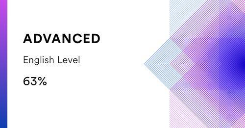

# Artem Smirnov

## Junior Frontend Developer

## Contact information:
* __City:__ Kazan
* __Email:__ eremidz@yahoo.com
* __Skype:__ set..13
* __Discord:__ ArtemS#5304
* __Telegram:__ [@Artem_Smi](https://t.me/Artem_Smi)
* __Github:__ [Eremor](https://github.com/Eremor)

## Summary
My main goal is to change professional activities. At the moment, I work as a systems engineer and I understand that I have come to the point where I do not have enough current work intellectually, therefore, I began to actively study programming. For these purposes, I try to allocate as much time as possible and "absorb" the information with great zeal.

## Skills
* HTML5, CCS3
* JavaScript, TypeScript
* React, Redux
* Component library: Material UI, Ant Design
* Preprocessor: SCSS
* Module bundler: Webpack
* Figma
* a little Angular and Node.js

## Code examples
```JavaScript
  export class GameField extends BaseComponent {
    private cards: Card[] = [];

    constructor() {
      super('div', ['game__field']);
    }

    public clear(): void {
      this.cards = [];
    }

    public addCards(cards: Card[]): void {
      this.cards = cards;
      this.cards.forEach((card): void => this.addChildren([card.node]));

      setTimeout(() => {
        this.cards.forEach((card) => card.flipToBack());
      }, SHOW_TIME * 1000);
    }
  }
```

## Experience
| project | demo   | code   |
| :---    | :----: | :----: |
| RSLang  | [demo](https://rslang-eremor.netlify.app/) | [code](https://github.com/Eremor/rslang) |
| Match Match game | [demo](https://eremor-match-match-game.netlify.app/) | [code](https://github.com/Eremor/match-match-game) |
| Online ZOO | [demo](https://eremor.github.io/online-zoo/) | [code](https://github.com/Eremor/online-zoo) |
| Movie app | [demo](https://eremor.github.io/RSS-JSFE2022-preschool/movie-app/) | [code](https://github.com/Eremor/RSS-JSFE2022-preschool/tree/movie-app) |

## Education
* __FreeCodeCamp:__ [Responsive Web Design](https://www.freecodecamp.org/certification/eremor/responsive-web-design)
* __FreeCodeCamp:__ [JavaScript Algorithms and Data Structures](https://www.freecodecamp.org/certification/eremor/javascript-algorithms-and-data-structures)
* __RSSchool:__ [React](https://app.rs.school/certificate/gg9hwt7m)
* __RSSchool:__ [Front-End 2022Q1](https://app.rs.school/certificate/24pctvfj)

## Languages:
* __Russian:__ Native
* __English:__ Intermediate (B1)
<br>
